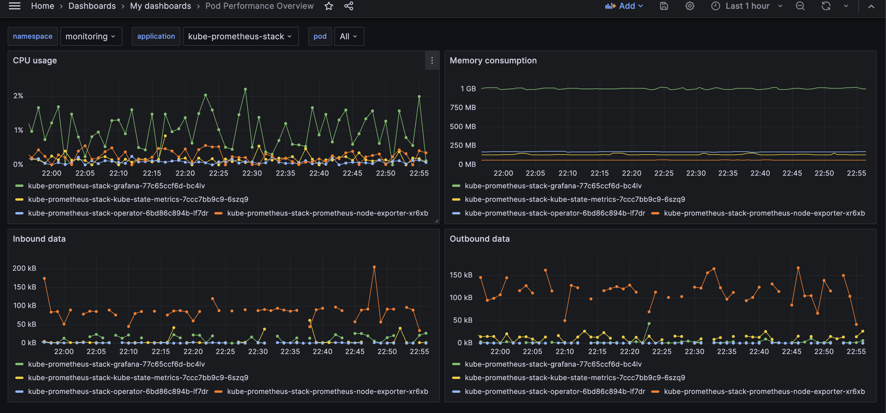
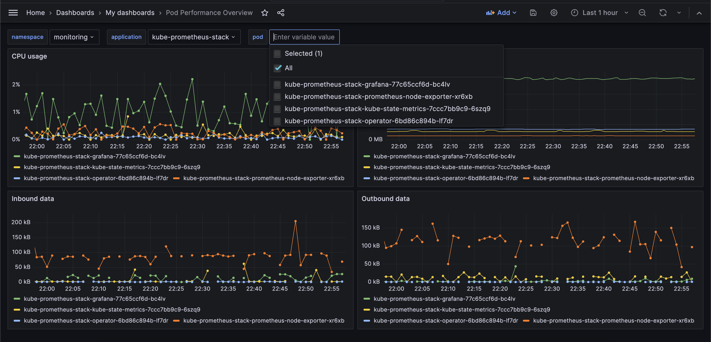
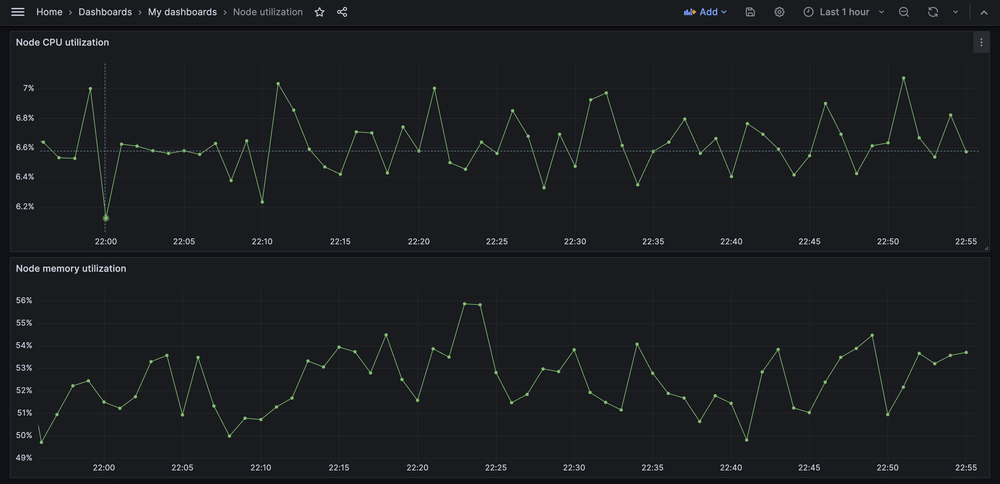

# Demo Grafana Dashboards

Explore the capabilities of cAdvisor metrics with these example Grafana dashboards.

## Contents

- [install.sh](./install.sh) - Bash script for a quick cluster setup.
- [charts](./charts/) - Includes values for installed community Helm charts and a sample busybox custom Helm chart.
- [dashboards](./dashboards/) - Exported dashboards from Grafana.

## Screenshots

